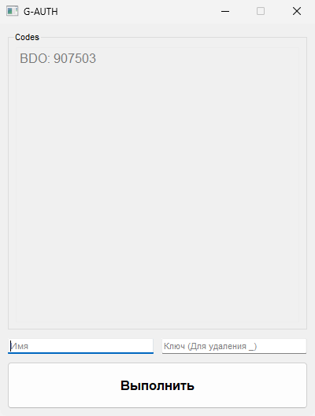

# G-Authenticator-PyQt5-GUI v0.0.1

### G-Authenticator 6-digit code generator
\
| Run main.py\
| Add name and secret key\
| Press button to add and get ur 6-digit code.

## Installation and Requirements



```
Python 3.12.6 (other versions not tested)

pip install PyQt5
```


## Changelog v0.0.1

[+] Init commit\